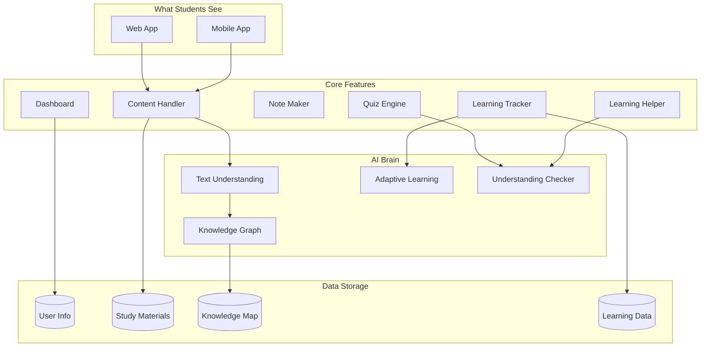
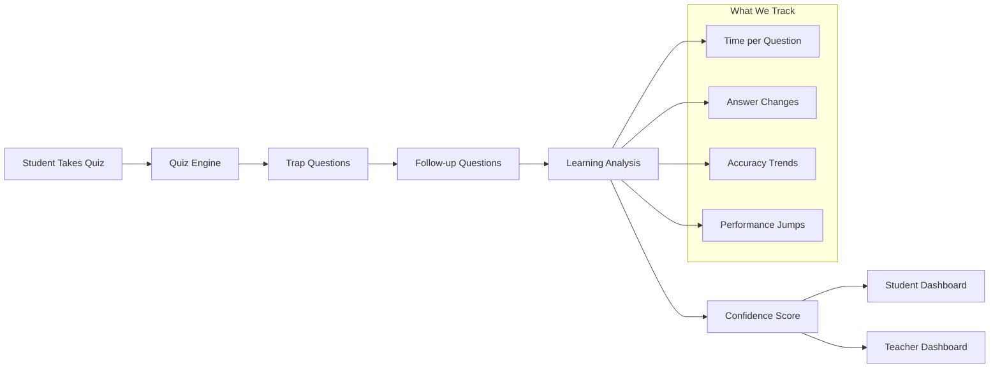

# Design Document: AI Study Platform

## What We're Building

We're creating a smart study platform that helps students learn better and faster. Think of it like having a personal tutor that understands how you learn and helps you improve. The platform uses AI to make studying more effective and includes light cheating detection to ensure fair learning.

## Core Features

✅ **AI Study Platform** - Smart content processing and personalized learning
✅ **Knowledge Graph** - Visual maps showing how concepts connect
✅ **Smart Notes** - Cornell, Outline, and Mind Mapping styles
✅ **Adaptive Quizzes** - Questions that adjust to your learning level
✅ **Weak Topic Detection** - Identifies areas needing more practice
✅ **Dashboards** - Progress tracking for students and teachers
✅ **Learning Integrity** - Light cheating detection with trap questions and follow-ups

## System Architecture



## Learning Integrity Process



## Core Components

### 1. AI Study Platform
**Content Handler:** Processes PDFs, PowerPoints, images into study materials
**Text Understanding:** Extracts key concepts and relationships
**Knowledge Graph:** Creates visual maps of how topics connect
**Learning Tracker:** Monitors progress and identifies weak areas
**Smart Learning:** Provides personalized recommendations

### 2. Knowledge Graph
- Visual representation of concept relationships
- Shows prerequisite topics and advanced connections
- Helps students understand learning pathways
- Updates dynamically as new content is added

### 3. Smart Notes Generation
**Cornell Method:** Questions, notes, and summary sections for active recall
**Outline Method:** Hierarchical structure with main topics and subtopics
**Mind Mapping:** Visual concept maps showing topic relationships

### 4. Adaptive Quizzes
- Questions adjust difficulty based on performance
- Personalized to target weak areas
- Multiple question types (multiple choice, short answer, problem solving)
- Real-time feedback and explanations

### 5. Weak Topic Detection
- Analyzes quiz performance to identify struggling areas
- Tracks learning patterns over time
- Provides targeted practice recommendations
- Integrates with adaptive quiz system

### 6. Dashboards

**Student Dashboard:**
- Quiz scores and learning progress
- Knowledge graph visualization
- Weak topic alerts and study suggestions
- Note generation tools
- Practice recommendations

**Teacher Dashboard:**
- Class performance overview
- Individual student progress
- Topic-wise difficulty analysis
- Students needing extra help

### 7. Learning Integrity (Light Cheating Detection)

**Trap Questions:**
- Special questions that look normal but test genuine understanding
- Embedded seamlessly in regular quizzes
- Check if students understand prerequisites for advanced topics
- Example: If solving complex equations, verify basic algebra understanding

**Follow-up Questions:**
- Triggered when inconsistent patterns are detected
- Test the same concept in different ways
- Maintain natural quiz flow
- Provide additional validation without being obvious

**What We Track:**
- Time spent on questions (unusually fast responses)
- Answer revision patterns
- Accuracy trends (sudden unexplained improvements)
- Conceptual consistency across related topics

**Confidence Scoring:**
- Simple High/Medium/Low confidence in genuine understanding
- Based on learning consistency and natural progression
- Used for supportive feedback, not punishment

## Data Models

```typescript
// Core User Data
interface User {
  id: string;
  email: string;
  role: 'student' | 'teacher';
  profile: UserProfile;
}

// Study Materials
interface StudyMaterial {
  id: string;
  userId: string;
  title: string;
  type: 'pdf' | 'powerpoint' | 'image' | 'text';
  extractedText: string;
  knowledgeGraphId?: string;
}

// Knowledge Graph
interface ConceptNode {
  id: string;
  name: string;
  description: string;
  prerequisites: string[];
  relatedConcepts: string[];
  difficulty: number;
}

// Quiz System
interface Quiz {
  id: string;
  topicId: string;
  questions: Question[];
  adaptiveLevel: number;
  integrityQuestions: TrapQuestion[];
}

interface Question {
  id: string;
  text: string;
  type: 'multiple_choice' | 'short_answer' | 'problem_solving';
  options?: string[];
  correctAnswer: string;
  explanation: string;
}

interface TrapQuestion {
  id: string;
  questionText: string;
  trapType: 'prerequisite_check' | 'concept_consistency';
  expectedUnderstanding: string;
  followUpQuestions: Question[];
}

// Learning Analytics
interface LearningSession {
  id: string;
  userId: string;
  topicId: string;
  startTime: Date;
  endTime: Date;
  performance: PerformanceMetrics;
  integrityCheck: IntegrityAssessment;
}

interface IntegrityAssessment {
  confidenceLevel: 'high' | 'medium' | 'low';
  consistencyScore: number;
  timingScore: number;
  conceptualScore: number;
  flaggedForReview: boolean;
}

// Notes
interface GeneratedNotes {
  id: string;
  userId: string;
  topicId: string;
  style: 'cornell' | 'outline' | 'mind_map';
  content: string;
  generatedAt: Date;
}

// Dashboard Data
interface StudentDashboard {
  userId: string;
  overallProgress: number;
  weakTopics: string[];
  recentQuizScores: QuizScore[];
  knowledgeGraph: ConceptNode[];
  studySuggestions: string[];
  integrityStatus: 'good' | 'needs_review';
}

interface TeacherDashboard {
  classId: string;
  studentProgress: StudentProgress[];
  topicDifficulty: TopicDifficulty[];
  studentsNeedingHelp: string[];
  integrityAlerts: IntegrityAlert[];
}
```

## Key Features Implementation

### Knowledge Graph Creation
1. Extract concepts from study materials using NLP
2. Identify relationships and prerequisites
3. Build visual graph representation
4. Update dynamically with new content

### Adaptive Quiz Engine
1. Start with baseline difficulty assessment
2. Adjust question difficulty based on performance
3. Focus on weak topics identified by the system
4. Embed trap questions for integrity checking

### Weak Topic Detection Algorithm
```typescript
function detectWeakTopics(studentId: string): WeakTopic[] {
  const quizHistory = getQuizHistory(studentId);
  const performanceByTopic = analyzePerformance(quizHistory);
  
  return performanceByTopic
    .filter(topic => topic.accuracy < 70 || topic.consistencyScore < 0.8)
    .sort((a, b) => a.accuracy - b.accuracy);
}
```

### Learning Integrity System
```typescript
function checkLearningIntegrity(quizAttempt: QuizAttempt): IntegrityAssessment {
  const timingScore = analyzeResponseTiming(quizAttempt);
  const consistencyScore = checkConceptualConsistency(quizAttempt);
  const trapResults = evaluateTrapQuestions(quizAttempt);
  
  const confidenceLevel = calculateConfidence(timingScore, consistencyScore, trapResults);
  
  return {
    confidenceLevel,
    consistencyScore,
    timingScore,
    conceptualScore: trapResults.score,
    flaggedForReview: confidenceLevel === 'low'
  };
}
```

### Note Generation
```typescript
function generateNotes(content: string, style: NoteStyle): GeneratedNotes {
  switch(style) {
    case 'cornell':
      return generateCornellNotes(content);
    case 'outline':
      return generateOutlineNotes(content);
    case 'mind_map':
      return generateMindMap(content);
  }
}
```

## Privacy & Ethics

**What We Track:**
- ✅ Quiz responses and timing for learning insights
- ✅ Study material interaction for personalization
- ✅ Learning progress for weak topic detection
- ✅ Basic integrity patterns for fair assessment

**What We Don't Track:**
- ❌ Device monitoring or keystroke logging
- ❌ Personal data beyond learning context
- ❌ Invasive surveillance techniques
- ❌ Punitive tracking methods

**Our Approach:**
- Transparent about what we monitor and why
- Focus on helping students learn, not catching violations
- Supportive feedback when integrity confidence is low
- Privacy-first design with minimal data collection

## Technical Stack

**Frontend:** React/Vue.js for web, React Native for mobile
**Backend:** Node.js/Python with microservices architecture
**AI/ML:** OpenAI GPT-4, spaCy for NLP, scikit-learn for analytics
**Databases:** PostgreSQL (user data), Neo4j (knowledge graph), Redis (caching)
**Infrastructure:** Docker containers, cloud deployment (AWS/GCP)

## Success Metrics

**Learning Effectiveness:**
- Improvement in quiz scores over time
- Reduction in weak topics per student
- Increased engagement with study materials
- Positive feedback on note generation quality

**System Performance:**
- Fast content processing (< 30 seconds)
- Quick dashboard loading (< 3 seconds)
- Real-time quiz feedback (< 2 seconds)
- High system availability (99.9% uptime)

**Integrity System:**
- Low false positive rate (< 5%)
- Effective detection of inconsistent learning patterns
- Positive student response to supportive feedback
- Teacher satisfaction with integrity insights

This design provides a comprehensive AI study platform with all the requested features while maintaining a focus on supportive learning rather than punitive monitoring.